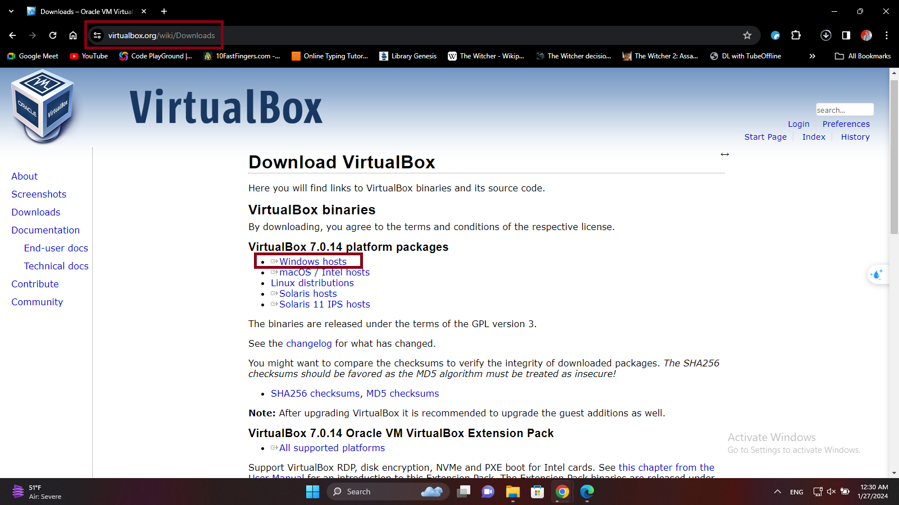

# **Installing Ubuntu on Oracle VirtualBox**

------

**IMPORTANT!** Make sure you have internet access during all of these processes.

1. ## **Download VirtualBox:**

   - Visit the [**Oracle VirtualBox website**](https://www.virtualbox.org/).

   - Download the version of VirtualBox that is **compatible** with your operating system (Windows, macOS, or Linux).

     

     

2. ## **Install VirtualBox:**

   - Run the installer, follow the on-screen instructions and wait for the installation to finish.

     

     

3. ## **Download Ubuntu ISO:**

   - Visit the [**Ubuntu website**](https://www.unbuntu.com) and download the latest **LTS version of Ubuntu**.

     

     

4. ## **Create a New Virtual Machine:**

   - Open VirtualBox and click on "**New**" to create a new virtual machine.

   - **Name** your virtual machine, **choose the directory** you want to install it in and **select the iso file** that you have previously downloaded.

     

     

   - check the "**Skip Unattended Installation**" box according to your requirements(the terminal that we will be needing later on during the installation of compilers **does not work sometimes if this is left unchecked**) and click next.

     

     

   - Set the **memory size** and processors according to your system specifications and click next.

     

     

   - Create a virtual hard disk and **allocate space** and click next.

     

   - Finally click on **finish** to finish creating a virtual machine.

     

5. ## **Install Ubuntu:**

   - Now **start** the virtual machine.

     

     

   - Select "**Try or Install Ubuntu**" and follow the on-screen instructions to install Ubuntu on the virtual machine.

     

     

     **Note:** if you had checked the "Skip Unattended Installation" box in the previous step you will have to install ubuntu **manually** otherwise it will open the desktop screen and start **downloading, installing and configuring files automatically**.

     ------

     Congratulations! you have successfully installed the **Ubuntu virtual OS** on your computer.

# **Installing C and C++ Compilers on Ubuntu**

------

Before moving ahead **make sure you have internet access** and the virtual Ubuntu OS is working properly.

1. ## **Open Terminal:**

   - Press **`Ctrl + Alt + T`** to open the terminal.

   - Or open the **Dock** and select the terminal icon.

     

     

2. ## **Install C Compiler (GCC):**

   - Enter the following command into the terminal.

     ```
     sudo apt install gcc
     ```

     

     

     

   - After entering this command, enter the **password** for your Virtual OS if needed

   - If you have an internet connection the C compiler will start **downloading and installing** automatically.

     

     

3. ## **Install C++ Compiler (g++):**

   - **Repeat step 2** after making the following changes in the previous command.

     ```
     sudo apt install g++
     ```

     

4. ## **Verify Installations:**

   - Check if the compilers have been successfully installed and their versions.

     ```
     gcc --version
     g++ --version
     ```

     

     ------
     
     Now, you have a fully **functional Ubuntu virtual machine on Oracle VirtualBox** with **C and C++ compilers** installed. You can use the terminal to write and compile C and C++ programs on your virtual machine.

# **GitHub Repository Link**

------

**2022-CS-214	Muhammad Aanish Naveed	[https://github.com/7Reaper7/OS-Lab](https://github.com/7Reaper7/OS-Lab)**

