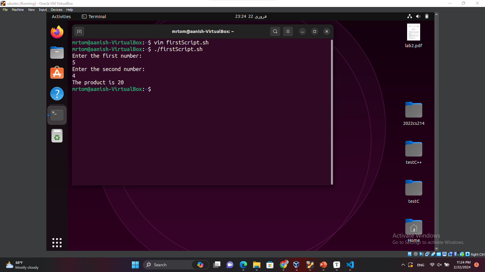

# **Operating System Lab 4 - SHELL Scripts**

------

In this lab we will be guiding a user called **mr tom** in performing different tasks using shell scripts.

## <span style="font-size: 1.1em;">Setting Up:</span>

Here are the basic things you need to know before performing the tasks:

- #### How to **Create** a script file:

  1. Create a **new file** using **touch** command and set its **extension** to **.sh**.
  2. Change its **permission** to allow execution using the **chmod** command.

- #### How to **Edit** a script file:

  There are two ways you can edit a **.sh** file:

  - Using the **nano** command.

  - using the **vim** command.

    ```
    vim filename.sh
    ```

    **note:** to use the vim editor you must first install and configure it.
    To do this, use the following command:

    ```
    sudo apt-get install vim
    ```

- #### How to **Execute** a script file:

  1. You can execute the script file using the following command

     ```
     ./filename.sh
     ```

Remember to use the **shebang** construct in the start of every script (if you are using the **Bourne Again Shell**)

```
#!/bin/bash
```

## <span style="font-size: 1.1em;">TASK 1  - Basic Tasks:</span>

- We can use various methods to create a **SHELL Script** that will take two command line arguments and **multiply** them together.

  Two of these are shown below:

  1. You can take the two arguments directly while **executing the script**.

     

     

  2. You can also use the **read** command in the script to achieve the same results.

     

     

- Now we will use the **read** command to take some **information** from **mr tom** and display it using the **echo** command.

  

  

- To help **mr tom** find his **current location** we can use the **$HOME** command in conjunction with the **echo** command.

  

  

- To get the **list** of all **files and directory** in the current directory you can use the **ls** command in the script.

  

  

- To display the **current time**, you can use the **date** command in the script.

  

  

- Now display a **"Thank You"** message simply using **echo** command.

  

  

## <span style="font-size: 1.1em;">TASK 2 - Using Operators:</span>

- **Arithmetic operations** can be performed using script through different methods:

  One of which is the **double parenthesis** method:

  Using **different operators** with double parenthesis method to **perform basic arithmetic and printing my roll number**.

  

  

- In the same way, **Relational Operators** can also be used:

  Using all the **relational operators and printing my roll number** (it will display either **1 or 0** which represent **true and false** respectively).
  
  
  
  

## <span style="font-size: 1.1em;">GitHub Repo Link:</span>

https://github.com/7Reaper7/OS
