# Windows Installation Guide

Follow these step-by-step instructions to download and install Windows on your PC.

## Step 1: Download Windows ISO

1. Visit the official Microsoft website at [https://www.microsoft.com](https://www.microsoft.com).
2. Navigate to the "Windows" section.
3. Find and select the version of Windows you want to install (e.g., Windows 11).
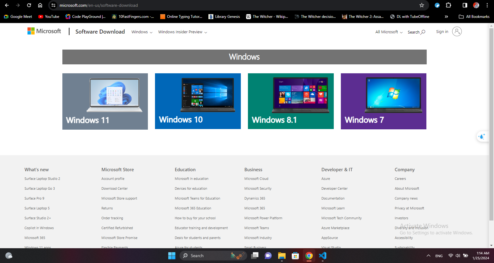
4. Click on the "Download" button.
5. Choose the appropriate edition and language, then click "Confirm."
6. Select the 32-bit or 64-bit version based on your system architecture.
7. Click "Download" to start the download of the Windows ISO file.
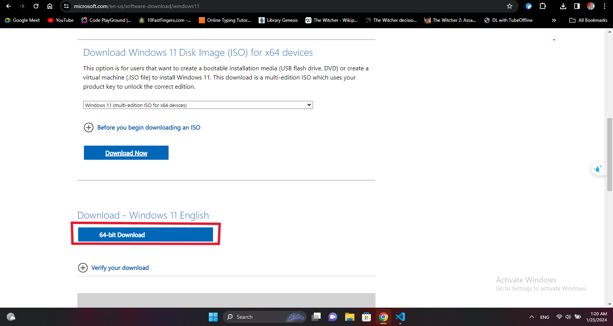

## Step 2: Create Bootable USB Drive

1. Insert a USB flash drive with at least 8GB of space into your computer.
2. Download and install a tool like [Rufus](https://rufus.ie/).

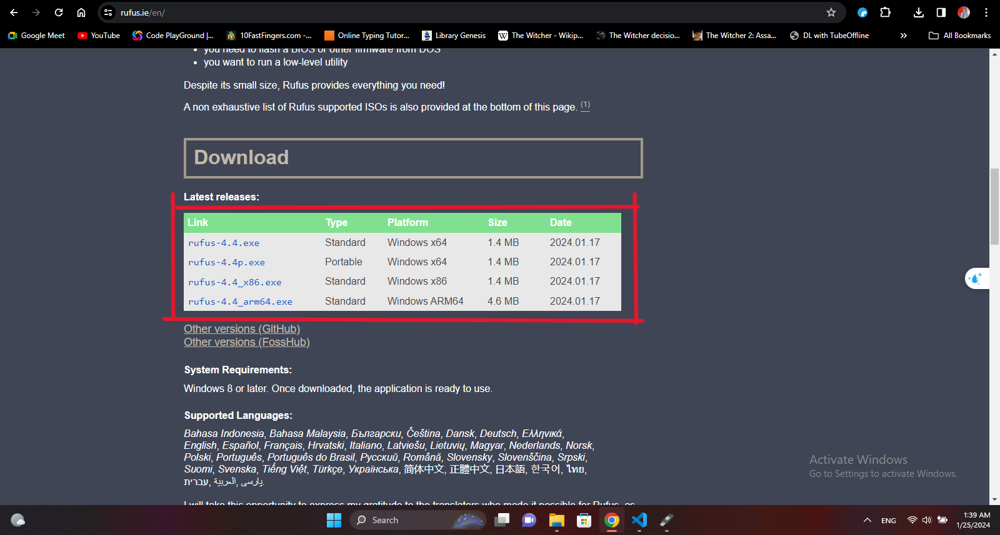

3. Open the tool and select the Windows ISO file you downloaded.
4. Choose the USB drive as the destination.
5. Click "Start" to create a bootable USB drive.

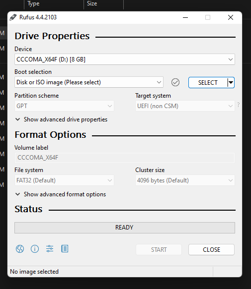

Now it should look something like this:

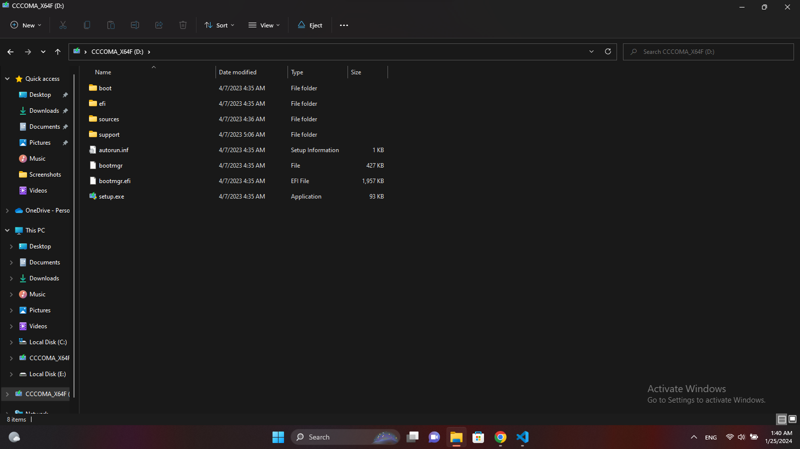

## Step 3: Boot from USB

1. Restart your computer.
2. Enter the boot menu key (different for different computers, f12 for me).
3. Select the USB you had installed the boot in.
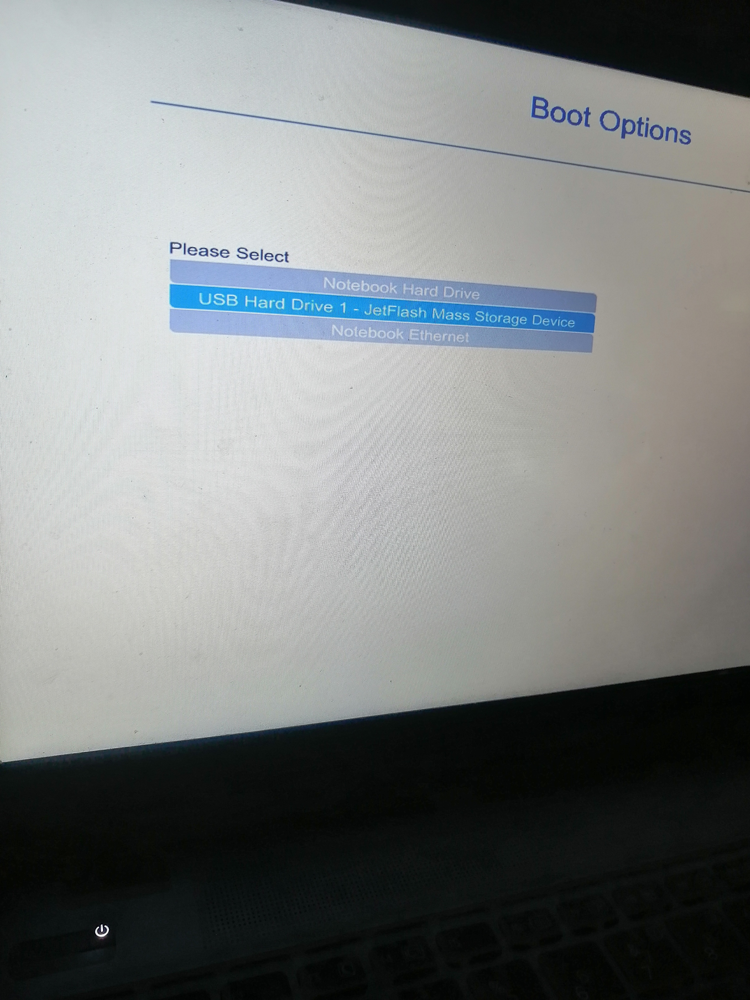

## Step 4: Install Windows

1. Your computer will now boot from the USB drive.
2. Select your language, time format, and keyboard input.
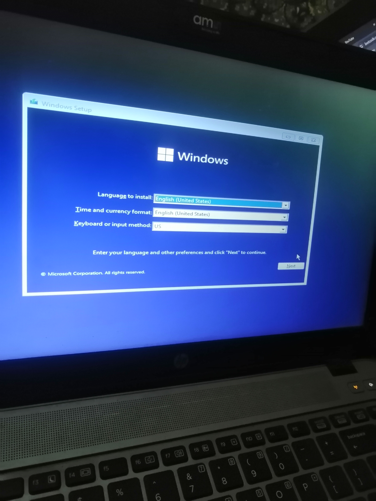
3. Click "Install Now."
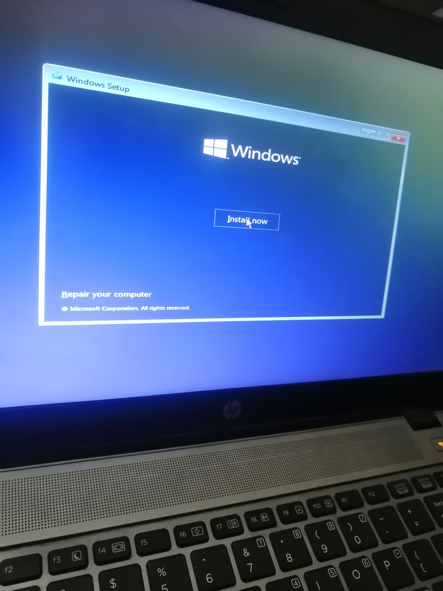
4. Enter the product key when prompted or choose to do it later.
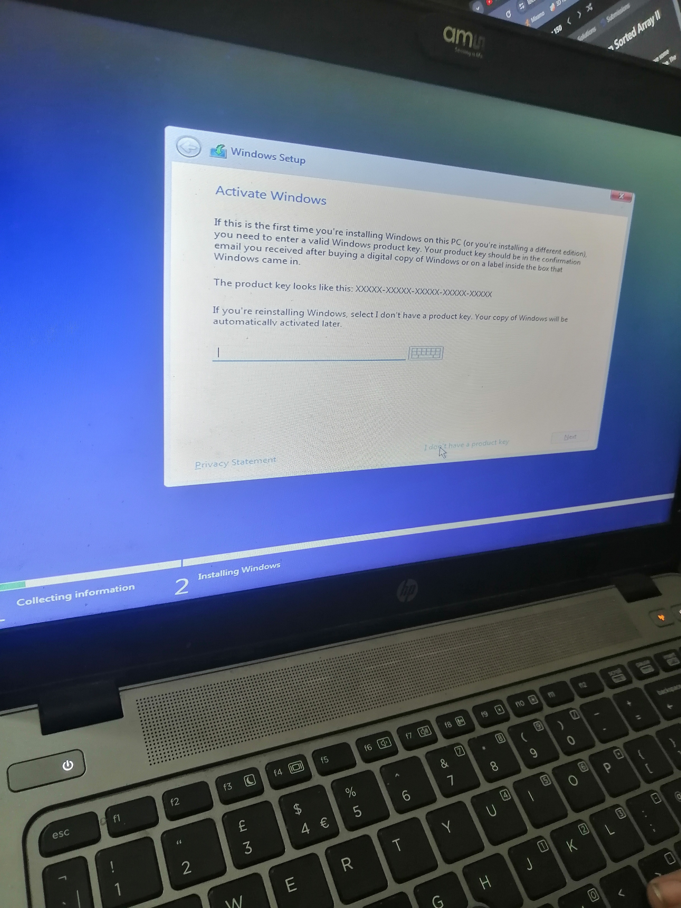
5. Select the edition of Windows you want to install.
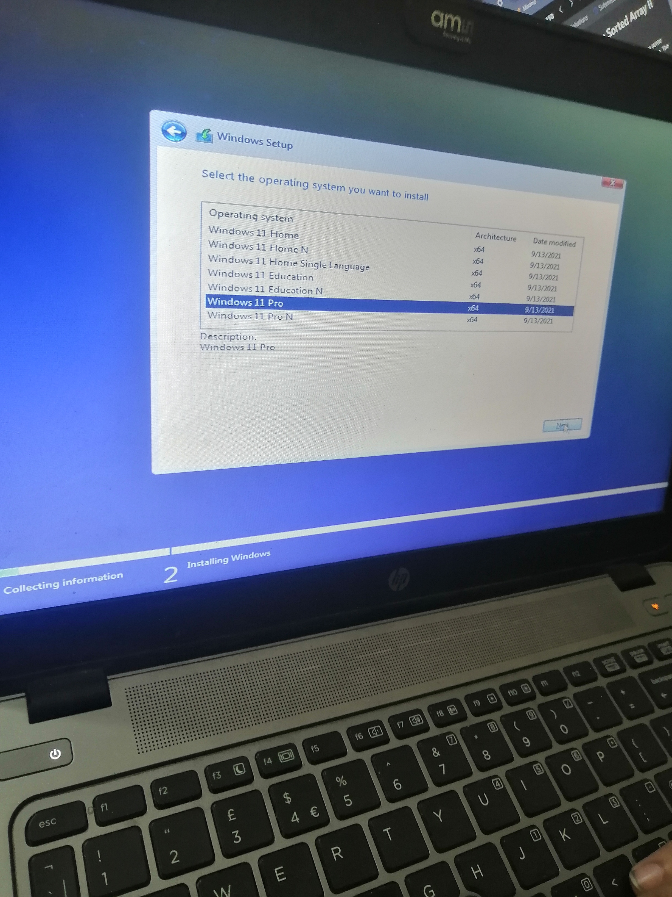
6. Accept the license terms and click "Next."
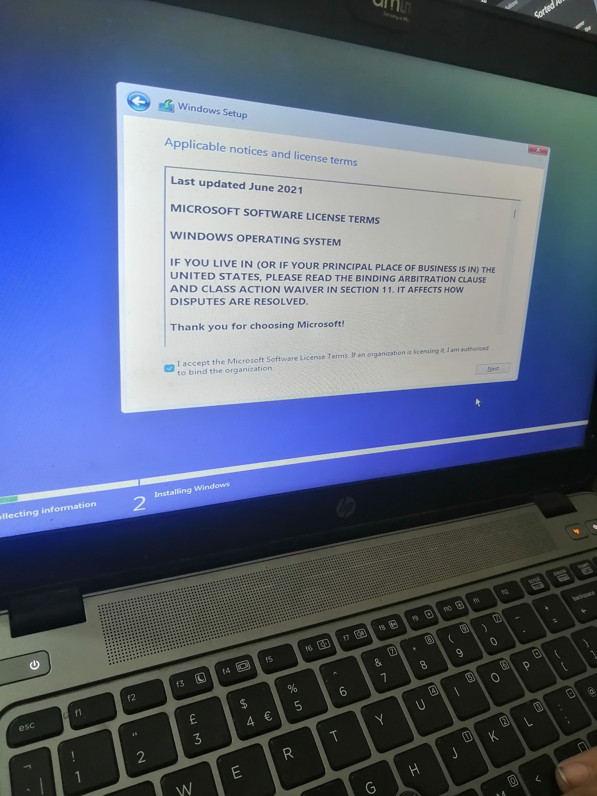
7. Select the type of installation you want
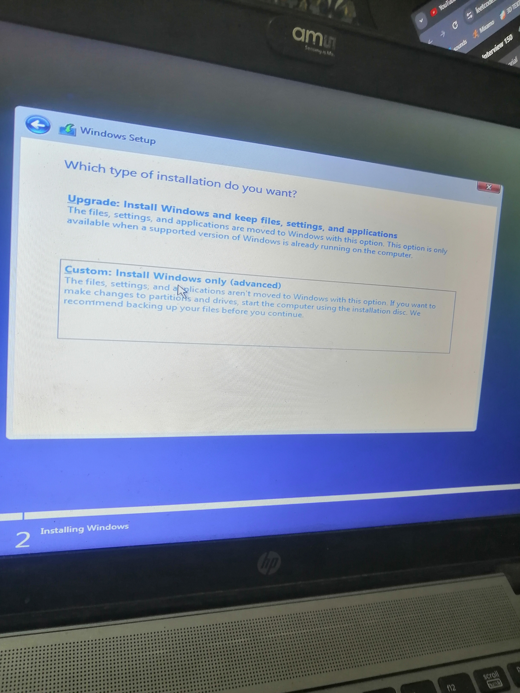

## Step 5: Partition and Install

1. Choose the drive where you want to install Windows.
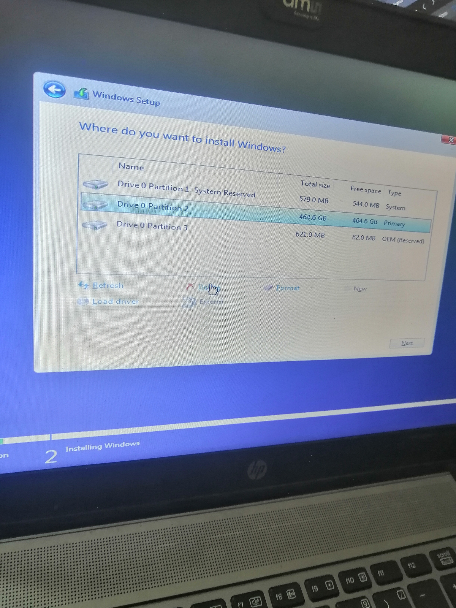
2. Click "Next" to start the installation and wait for it to complete.
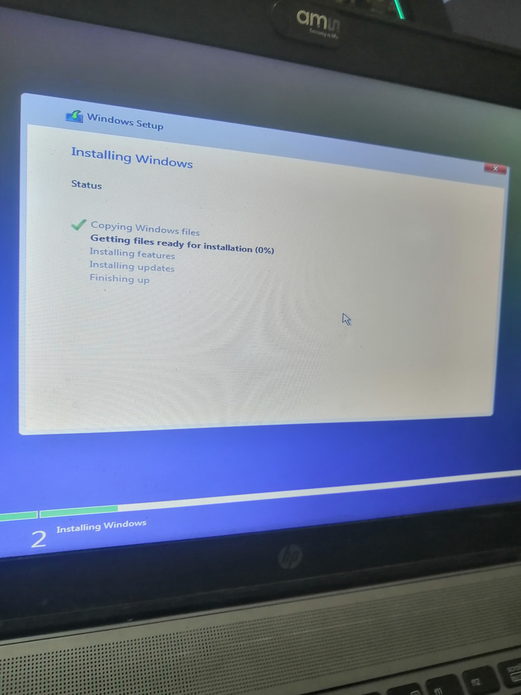
3. Windows will now install. This may take some time.
4. Follow on-screen instructions to set up your account.

Congratulations! You have successfully installed Windows on your PC.

**Note:** Ensure you back up important data before installing Windows, as the installation process may involve formatting the drive.
